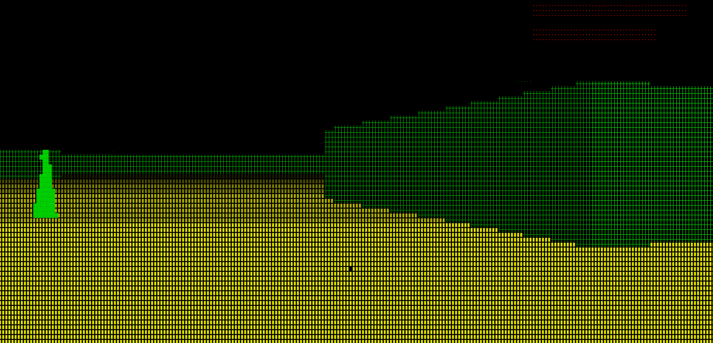

# Terminal Raycasting Demo

A simple first-person 3D renderer written in Python using the `curses` library.

The project uses a basic raycasting algorithm (similar to early games like Wolfenstein 3D) to render a 2D map as a pseudo-3D scene directly in the terminal.





## Features

- First-person camera
- Collision detection
- Raycasting renderer
- Terminal graphics using `curses`
- Keyboard movement
- Adjustable field of view
- Perspective wall rendering
- Radar
- Floor shading
- Score and enemy respawn system
- Medkit and health system
- Timer
- Best time is stored in file 
- Map loading

## Controls

| Key | Action |
|------|--------|
| W | Move forward |
| S | Move backward |
| A | Rotate left |
| D | Rotate right |
| Q | Quit |
| E | Use medkit |
| ↑ | Rotate up |
| ↓ | Rotate down |


## How to play


**How to win:** Kill 10 enemies to win, medkit appear as blue cubes: get near it to pick it up , 1 medkit gives you +20 health.


**How to lose:** If an enemy is near you, your health will decrease, game over when it reaches 0.


**First bar is for score, second is for health**


## Requirements

- Python 3
- Linux 
- Architecture : `x86_64`


## Important Notes

* **Terminal Size:** Ensure your terminal window is maximized (not small), otherwise the 3D projection rendering may break.
* **Colors:** This game is optimized for `xterm`. If colors look washed out or incorrect, make sure your terminal emulator supports 256 colors.
* **Font Size:** For the best visual experience and sharper 3D graphics, use a smaller terminal font size.

## Run

```bash
python3 main3d.py
```

## How it works

The renderer casts one ray for each column of the terminal.

Each ray:
1. Starts at the player's position.
2. Travels forward until it hits a wall.
3. Measures the distance.
4. Calculates the projected wall height.
5. Draws a vertical slice of the wall.

To reduce the fisheye effect, the measured distance is corrected using the cosine of the viewing angle.

## Map

The world is stored as a 2D grid.

- `1` = wall
- `0` = empty space
- `2` = enemy

**Map can be any list of lists with 0 and 1 and you can make your own in file `mapa_ascii_3d.json`, map can be as long as you want but it have to have same number of columns and rows, one list is one row, file named `mapa_ascii_3d.json` is template, if game wouldn't find any map with that name , map will be generated**

## Future improvements
